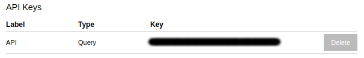

```{r setup, include = FALSE}
knitr::opts_chunk$set(eval = TRUE, warning = FALSE, message = FALSE, cache = TRUE)
```

# APIs

## The what...

An [API key](https://en.wikipedia.org/wiki/Application_programming_interface_key) is essentially a password that gives you access to the server you are requsting data from. Typically you have to register with a service provider to obtain a key. The key is then your unique identifier for the platform you've registered on.

```{r pic, echo=FALSE, fig.cap="This work is in the [Public domain](https://en.wikipedia.org/wiki/Public_domain) (uploaded to [Wikipedia](https://commons.wikimedia.org/wiki/File:The_sleeping_beauty_picture_book_-_containing_The_sleeping_beauty,_Bluebeard,_The_baby%27s_own_alphabet_(1911)_(14593023788).jpg) by [FlickreviewR](https://commons.wikimedia.org/wiki/User:FlickreviewR))", out.width = '50%'}
knitr::include_graphics("https://upload.wikimedia.org/wikipedia/commons/5/59/The_sleeping_beauty_picture_book_-_containing_The_sleeping_beauty%2C_Bluebeard%2C_The_baby%27s_own_alphabet_%281911%29_%2814593023788%29.jpg")
```

## ... and the how.

### Registering for an [MfE](https://data.mfe.govt.nz/) API key

To [sign up](https://data.mfe.govt.nz/) for this service you will be asked to create a [Koordinates](https://koordinates.com/about/) account; this is the geospatial data management system the [MfE](https://data.mfe.govt.nz/) use. Your API key can then be accssesd via the [API's and Web Services](https://data.mfe.govt.nz/my/api/) dropdown.

```{r mfe, echo=FALSE, fig.cap="Accsses your API key via the [API's and Web Services](https://data.mfe.govt.nz/my/api/) dropdown", out.width = '50%'}

```


### Setting your API key in `eeda`

```{r lib, eval = FALSE}
library(eeda)
```


Data is downloaded from two platforms and each require an API key to be set. Your key for thee [MfE](https://data.mfe.govt.nz/) data portal can be set using the `eeda_auth()` function; your API key shoul be supplied as a character string to the  `key` arqument.


```{r mfe key, eval = FALSE}
eeda_auth(key = key, platform = "mfe")
```

To check which keys you have registered in for use by `eeda` functions use

```{r check, eval = FALSE}
eeda_keys()
```

### Using your API key

`eeda` functions that require an API key are those that download data from the spcified platform. These function each have a `key` argument that can be used to set your key manually; howver this is **not** recommended, especially if you plan to share work etc.

```{r get_data, eval = TRUE, echo = 5}
## setting keys from local file
library(eeda)
key <- read.delim("keys.txt",header = FALSE)$V1
eeda_auth(key = key)
data <- get_mfe_data(id = "layer-53523")
```

